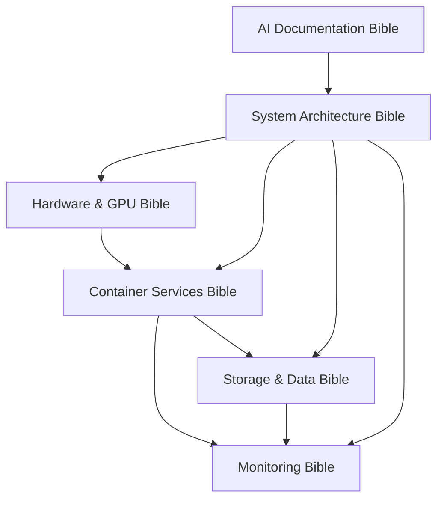

# AI Bible Documentation System - System Architecture

## 🎯 Executive Summary

Based on comprehensive analysis of 22 existing documentation files, this document defines the architecture for a threshold-based "Bible Documentation System" that consolidates fragmented documentation into 6 definitive bibles with intelligent AI-driven updates.

## 📊 Current State Analysis

### Documentation Fragmentation Issues Identified
- **Content Duplication**: 3 monitoring docs with 70% overlap, identical duplicate files
- **Inconsistent Updates**: AI-generated sections mixed with static content
- **Scattered Information**: Related concepts split across multiple files
- **Historical Bloat**: 4 files that should be archived (task logs, progress tracking)
- **Update Chaos**: 22 files with different update frequencies and patterns

### Content Distribution
- **High-Density Technical Guides**: 12 files (GPU, storage, monitoring, optimization)
- **Medium-Density Overviews**: 8 files (system concepts, user guides)
- **Low-Value Archives**: 4 files (completed tasks, duplicates, point-in-time tracking)

## 🏗️ Bible Architecture Design

### Core Design Principles
1. **Functional Consolidation**: Group by system function, not implementation chronology
2. **Authoritative Sources**: Each bible is the definitive source for its domain
3. **Minimal Overlap**: Clear boundaries with defined cross-references
4. **Update Efficiency**: Threshold-based updates prevent unnecessary AI processing
5. **Consistency Maintenance**: Cross-bible validation ensures system coherence

### 6-Bible Structure

#### 1. **Hardware & GPU Acceleration Bible**
**Scope**: Physical hardware, GPU configuration, device access, performance optimization
**Consolidates**:
- GPU_ACCELERATION_GUIDE.md (350+ lines of GPU config)
- JELLYFIN-GPU-SETUP.md (Jellyfin-specific GPU setup)
- SKETCHUP-VM-SETUP.md (VM GPU passthrough)
- Hardware sections from SYSTEM_CONCEPTS_AND_ARCHITECTURE.md

**Content Areas**:
- NVIDIA Quadro P1000 configuration and Pascal architecture specifics
- Container GPU device access patterns and environment variables
- Service-specific GPU utilization (Frigate TensorRT, Jellyfin transcoding, Ollama CUDA)
- Performance monitoring and troubleshooting
- VM GPU passthrough for specialized applications

**Update Triggers**: GPU driver changes, new GPU-accelerated services, hardware modifications

#### 2. **Container Services & Orchestration Bible**
**Scope**: Podman containers, service configuration, networking, systemd integration
**Consolidates**:
- ARR_APPS_OPTIMIZATION_GUIDE.md (363 lines of *arr configuration)
- MEDIA_PIPELINE_CONFIGURATION_GUIDE.md (370 lines of service config)
- BUSINESS_SERVICES_GUIDE.md (business intelligence services)
- FRIGATE_OPTIMIZATION_GUIDE.md (302 lines of camera system config)

**Content Areas**:
- Media management services (*arr applications, download clients)
- Surveillance system (Frigate object detection, Home Assistant)
- Business intelligence (dashboards, APIs, databases)
- Container networking and inter-service communication
- Service-specific optimization and troubleshooting

**Update Triggers**: New services, container configuration changes, networking modifications

#### 3. **Storage & Data Pipeline Bible**
**Scope**: Storage architecture, data flows, automation, backup strategies
**Consolidates**:
- HOT_COLD_STORAGE_WORKFLOW.md (578 lines of storage automation)
- Storage sections from multiple media pipeline docs
- Data flow concepts from architecture docs

**Content Areas**:
- Two-tier storage architecture (hot SSD, cold HDD)
- Automated data migration and retention policies
- Media pipeline workflows (download → process → archive)
- Backup strategies and disaster recovery
- Storage monitoring and capacity management

**Update Triggers**: Storage configuration changes, new automation workflows, capacity expansions

#### 4. **Monitoring & Observability Bible**
**Scope**: Metrics collection, dashboards, alerting, system health monitoring
**Consolidates**:
- MONITORING.md (architectural overview)
- MONITORING_OPTIMIZATION_GUIDE.md (688 lines of detailed optimization)
- GRAFANA_PROMETHEUS_USER_GUIDE.md (user interface guide)
- TROUBLESHOOTING.md (371 lines of diagnostic procedures)

**Content Areas**:
- Prometheus metrics collection and exporters
- Grafana dashboard design and provisioning
- Alert management and notification systems
- System health monitoring and diagnostics
- Performance optimization and capacity planning

**Update Triggers**: New metrics, dashboard changes, alerting modifications, performance issues

#### 5. **AI Documentation & Automation Bible**
**Scope**: AI documentation system, automation workflows, intelligent analysis
**Consolidates**:
- AI_DOCUMENTATION_IMPLEMENTATION_PLAN.md (753 lines of implementation)
- AI_DOCUMENTATION_SYSTEM_HOWTO.md (user guide and troubleshooting)
- Automation sections from other documents

**Content Areas**:
- Local Ollama AI model configuration and operation
- Automated documentation generation and analysis
- Git integration and post-build workflows
- AI prompt engineering and optimization
- Troubleshooting AI documentation failures

**Update Triggers**: AI system changes, new automation features, prompt modifications

#### 6. **System Architecture & Operations Bible**
**Scope**: Overall system design, deployment procedures, maintenance, troubleshooting
**Consolidates**:
- CLAUDE_CODE_SYSTEM_PRIMER.md (system overview)
- SYSTEM_CONCEPTS_AND_ARCHITECTURE.md (architectural concepts)
- OPTIMIZATION_SUMMARY.md (strategic overview)
- Deployment and maintenance procedures from various guides

**Content Areas**:
- NixOS configuration management and deployment
- System architecture and service relationships
- Security configuration (SOPS, VPN, Tailscale)
- Operational procedures and best practices
- Strategic optimization and system evolution

**Update Triggers**: Architectural changes, security updates, operational procedure changes

## 📋 Content Migration Strategy

### Files to Archive (Historical Value Only)
- `COMPLETED_TASKS_LOG.md` → Archive as `archive/completed-tasks-2025-08-06.md`
- `MASTER_TODO_LIST.md` → Archive as `archive/todo-snapshot-2025-08-06.md`  
- `AI_DOCUMENTATION_IMPLEMENTATION_PROGRESS.md` → Archive as `archive/ai-implementation-progress.md`
- `GREBUILD_AND_CADDY_FIXES_2025-08-06.md` → Merge into troubleshooting, archive duplicate

### Content Consolidation Rules
1. **Primary Source Priority**: Most comprehensive document becomes primary source
2. **Unique Content Extraction**: Extract unique sections from secondary sources
3. **Cross-Reference Preservation**: Maintain references between related concepts
4. **Version History**: Preserve implementation details in appropriate bible sections

### Overlap Resolution Strategy
- **Monitoring Trilogy**: Use MONITORING_OPTIMIZATION_GUIDE.md as primary (most comprehensive), integrate user-facing content from GRAFANA guide, archive MONITORING.md overview
- **Media Pipeline Docs**: Merge ARR_APPS_OPTIMIZATION_GUIDE.md and MEDIA_PIPELINE_CONFIGURATION_GUIDE.md into Container Services Bible
- **AI Documentation**: Consolidate implementation plan and howto into single comprehensive AI Bible
- **Architecture Overviews**: Merge primer and concepts into System Architecture Bible

## 🔄 Cross-Bible Dependency Mapping

### Primary Dependencies


### Specific Cross-References
- **Hardware → Container**: GPU device access configurations used by specific services
- **Container → Storage**: Service storage requirements and data flow configurations
- **Container → Monitoring**: Service-specific metrics and health checks
- **Storage → Monitoring**: Storage capacity and performance metrics
- **AI → System**: AI system integration with overall architecture
- **System → All Others**: Operational procedures reference all system components

### Consistency Validation Rules
- **GPU Configuration**: Hardware Bible changes trigger Container Bible GPU reference validation
- **Storage Paths**: Storage Bible path changes trigger Container Bible mount validation
- **Service Names**: Container Bible service changes trigger Monitoring Bible metric validation
- **Network Configuration**: System Bible network changes trigger Container Bible networking validation

## 📝 Bible Template Structure

### Standard Section Framework
```markdown
# [Bible Name]

## 🎯 Bible Scope
- Clear definition of what this bible covers
- Boundary definitions (what it doesn't cover)
- Primary use cases and audiences

## 🏗️ Architecture Overview
- High-level system design for this domain
- Key components and their relationships
- Integration points with other system areas

## 📋 Configuration Reference
- Comprehensive configuration examples
- Best practices and optimization guidelines
- Common patterns and templates

## 🔧 Operational Procedures
- Step-by-step operational tasks
- Troubleshooting and diagnostic procedures
- Maintenance and update procedures

## 📊 Monitoring & Validation
- Key metrics and monitoring points
- Health checks and validation procedures
- Performance benchmarks and optimization targets

## 🔗 Cross-Bible References
- Dependencies on other bibles
- Related concepts in other system areas
- Integration points and shared configurations

## 📚 Reference Materials
- Configuration file locations
- Log file locations and formats
- External documentation and resources

## 📈 Change Log
- Recent significant changes
- Upcoming planned modifications
- Historical evolution summary
```

### Bible-Specific Customizations
- **Hardware Bible**: Detailed device specifications, driver information, performance characteristics
- **Container Bible**: Service-specific configurations, network topologies, resource requirements
- **Storage Bible**: Data flow diagrams, automation workflows, capacity planning
- **Monitoring Bible**: Dashboard galleries, alert rule examples, metric definitions
- **AI Bible**: Prompt libraries, model configurations, automation workflows
- **System Bible**: Deployment procedures, security configurations, architectural decisions

## ⚡ Update Thresholds & Triggers

### Threshold Categories
1. **Minor Updates** (Change Count: 1-5): Simple configuration changes, small fixes
2. **Moderate Updates** (Change Count: 6-15): Service additions, configuration overhauls
3. **Major Updates** (Change Count: 16+): Architectural changes, major feature additions

### Bible-Specific Thresholds
- **Hardware Bible**: Low threshold (3 changes) - Hardware changes are rare but critical
- **Container Bible**: Medium threshold (8 changes) - Services change frequently
- **Storage Bible**: Medium threshold (6 changes) - Storage changes impact multiple services
- **Monitoring Bible**: High threshold (10 changes) - Metrics change frequently
- **AI Bible**: Low threshold (4 changes) - AI system changes require immediate documentation
- **System Bible**: Low threshold (5 changes) - Architectural changes are critical

### Special Triggers
- **Emergency Updates**: Security fixes, critical bugs bypass thresholds
- **Cross-Bible Updates**: Changes affecting multiple bibles trigger consistency checks
- **Manual Overrides**: Ability to force bible updates regardless of thresholds
- **Time-Based Triggers**: Monthly review cycle regardless of change count

## 🎯 Success Metrics

### Quality Metrics
- **Consistency**: Cross-bible references remain accurate (>95% validation success)
- **Completeness**: All system functionality documented in appropriate bible (100% coverage)
- **Currency**: Documentation reflects actual system state (<2 week lag maximum)
- **Accessibility**: Clear structure enables quick information location (<2 minutes to find specific info)

### Performance Metrics
- **Update Efficiency**: Bible updates complete in <5 minutes per bible
- **Build Impact**: Bible system adds <30 seconds to rebuild workflow
- **Storage Efficiency**: 50% reduction in documentation file count
- **Maintenance Reduction**: 80% reduction in manual documentation updates

### Operational Metrics
- **Error Rate**: Bible system failures <1% of rebuild cycles
- **Consistency Issues**: Cross-bible conflicts detected and resolved automatically
- **User Satisfaction**: Documentation users can find information without referencing multiple files
- **System Evolution**: Documentation automatically evolves with system changes

---

**Document Version**: 1.0  
**Created**: 2025-08-06  
**Architecture**: 6 specialized bibles replacing 22 fragmented documents  
**Next Phase**: Bible template creation and content migration planning