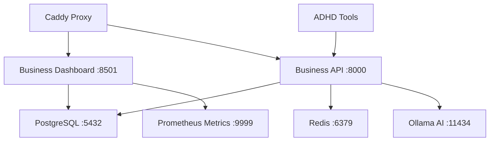

# 🏢 Business Services Guide - NixOS Homeserver

**Complete documentation for business intelligence, analytics, and productivity services on the NixOS homeserver.**

## 🎯 Overview

The homeserver includes a comprehensive business services stack designed for document processing, business intelligence, and ADHD-friendly productivity tracking. All services run in containers with GPU acceleration and AI integration.

## 🚀 Quick Access

### Web Interfaces
- **Business Dashboard**: `https://hwc.ocelot-wahoo.ts.net/dashboard/`
- **Business API**: `https://hwc.ocelot-wahoo.ts.net/business/`

### Service Status
```bash
# Check all business services
sudo systemctl status podman-business-api.service
sudo systemctl status podman-business-dashboard.service
sudo systemctl status postgresql.service
sudo systemctl status redis.service
sudo systemctl status ollama.service

# Quick health check
curl -f https://hwc.ocelot-wahoo.ts.net/dashboard/ || echo "Dashboard offline"
curl -f https://hwc.ocelot-wahoo.ts.net/business/health || echo "API offline"
```

## 🏗️ Service Architecture

### Core Business Stack



### 1. **Business API Service** ⚡
- **Purpose**: FastAPI-based REST API for business operations
- **Port**: 8000 (internal), `/business*` (external)
- **Container**: Python 3.11 with business dependencies
- **Database**: PostgreSQL (`heartwood_business`)
- **Features**:
  - Document processing with OCR (tesseract, opencv4)
  - PDF processing (pdf2image, poppler_utils)
  - JobTread API integration
  - Database migrations (alembic)
  - AI-powered document analysis

**Key Endpoints**:
```bash
GET  /business/health              # Health check
POST /business/documents/upload    # Document upload
GET  /business/analytics/summary   # Business metrics
POST /business/ai/analyze          # AI document analysis
```

### 2. **Business Intelligence Dashboard** 📊
- **Purpose**: Streamlit-based real-time analytics
- **Port**: 8501 (internal), `/dashboard*` (external)
- **Container**: Python 3.11-slim with auto-dependencies
- **Features**:
  - System overview (CPU, memory, services)
  - Media pipeline monitoring
  - Storage analytics with cost estimation
  - Performance metrics and GPU utilization
  - Mobile-responsive design

**Dashboard Sections**:
- **System Overview**: Resource usage, service status
- **Media Analytics**: Download queues, import rates
- **Storage Intelligence**: Tier efficiency, cost projections
- **Business Metrics**: Document processing, revenue tracking

### 3. **Business Metrics Exporter** 📈
- **Purpose**: Custom Prometheus metrics for business intelligence
- **Port**: 9999 (internal)
- **Integration**: Grafana dashboards
- **Metrics**:
  - Media library statistics
  - Storage efficiency ratios
  - Processing performance
  - Cost estimations
  - User activity counters

## 💾 Database Services

### PostgreSQL Business Database
```bash
# Database info
Host: localhost:5432
Database: heartwood_business
User: business_user
Password: [SOPS encrypted]

# Connection check
sudo -u postgres psql -d heartwood_business -c "SELECT version();"

# Backup location
ls -la /opt/business/backups/
```

**Database Schema**:
- **documents**: Uploaded files and metadata
- **analytics**: Business intelligence data
- **ai_analyses**: AI processing results
- **user_sessions**: Activity tracking

### Redis Cache
```bash
# Redis info
Host: localhost:6379
Purpose: Session management, caching

# Check Redis
redis-cli ping
redis-cli info memory
```

## 🤖 AI/ML Integration

### Ollama AI Service
```bash
# Service status
systemctl status ollama
ollama list

# Available models
llama3.2:3b          # Lightweight business intelligence
nomic-embed-text     # Document embeddings/RAG

# Test AI service
curl http://localhost:11434/api/generate \
  -d '{"model":"llama3.2:3b","prompt":"Hello"}'
```

**AI Capabilities**:
- Document analysis and summarization
- Business intelligence insights
- Automated system documentation
- Receipt and invoice processing
- Context-aware productivity suggestions

### AI Documentation System
- **Purpose**: Automated documentation generation
- **Trigger**: Git post-commit hooks
- **Features**:
  - System evolution narratives
  - Technical documentation updates
  - Change impact analysis

## 📁 Directory Structure

### Business Data (`/opt/business/`)
```
/opt/business/
├── api/                    # FastAPI application
│   ├── app/               # Main application code
│   ├── models/            # SQLAlchemy models
│   ├── routes/            # API endpoints
│   └── services/          # Business logic
├── uploads/               # Document uploads
├── receipts/              # Receipt processing
├── processed/             # Processed documents
├── dashboard/             # Streamlit components
├── config/                # Configuration files
├── backups/               # Database backups (daily)
└── logs/                  # Application logs
```

### AI/ML Data (`/opt/ai/`)
```
/opt/ai/
├── models/                # AI model storage
├── context-snapshots/     # Conversation contexts
├── document-embeddings/   # Vector database
└── business-rag/         # RAG system data
```

### ADHD Productivity (`/opt/adhd-tools/`)
```
/opt/adhd-tools/
├── context-snapshots/     # Work session saves
├── focus-logs/           # Focus tracking
├── energy-tracking/      # Energy monitoring
└── scripts/              # Automation scripts
```

## 🔧 Configuration Management

### Environment Variables
```bash
# Business API configuration
POSTGRES_HOST=localhost
POSTGRES_PORT=5432
POSTGRES_DB=heartwood_business
POSTGRES_USER=business_user
POSTGRES_PASSWORD=[SOPS encrypted]

REDIS_URL=redis://localhost:6379
OLLAMA_URL=http://localhost:11434

# Dashboard configuration
STREAMLIT_SERVER_PORT=8501
STREAMLIT_SERVER_ADDRESS=0.0.0.0
```

### SOPS Encrypted Secrets
```bash
# View encrypted secrets
sops /etc/nixos/secrets/business.yaml

# Decrypt for debugging (careful!)
sops -d /etc/nixos/secrets/business.yaml | grep business_password
```

## 🎯 ADHD Productivity Features

### Context Monitoring
- **45-minute work session alerts**: Prevents hyperfocus burnout
- **Context snapshots**: Automatic save points for complex tasks
- **Energy tracking**: 1-10 scale correlation with productivity
- **Focus session analysis**: Performance pattern recognition

### Productivity Tools
```bash
# Energy level tracking
curl -X POST http://localhost:8000/business/adhd/energy \
  -d '{"level": 7, "notes": "Good morning energy"}'

# Context snapshot
curl -X POST http://localhost:8000/business/adhd/snapshot \
  -d '{"context": "Working on NixOS config", "focus_mode": true}'

# Focus session stats
curl http://localhost:8000/business/adhd/focus-stats
```

## 📊 Monitoring & Analytics

### Key Metrics Dashboard
- **System Health**: CPU, memory, disk usage
- **Service Status**: All container states
- **Media Pipeline**: Download/import rates
- **Storage Efficiency**: Hot/cold tier optimization
- **Cost Analysis**: Infrastructure spend estimation
- **GPU Utilization**: AI workload monitoring

### Business Intelligence
- **Document Processing**: OCR success rates
- **Revenue Tracking**: Project profitability
- **Time Analysis**: Productivity patterns
- **Energy Correlation**: ADHD management effectiveness

### Grafana Integration
```bash
# Business metrics in Grafana
- Business API response times
- Document processing volume
- Storage efficiency ratios
- AI model usage statistics
- ADHD productivity correlations
```

## 🔍 Troubleshooting

### Common Issues

**Dashboard not loading**:
```bash
sudo systemctl restart podman-business-dashboard.service
sudo podman logs business-dashboard
```

**API connection errors**:
```bash
sudo systemctl restart podman-business-api.service
sudo systemctl status postgresql.service
sudo systemctl status redis.service
```

**Database connectivity**:
```bash
# Test PostgreSQL connection
sudo -u postgres psql -d heartwood_business -c "SELECT 1;"

# Check Redis
redis-cli ping
```

**AI service issues**:
```bash
systemctl status ollama
ollama list
ollama pull llama3.2:3b  # Redownload if needed
```

### Log Locations
```bash
# Container logs
sudo podman logs business-api
sudo podman logs business-dashboard

# System logs
sudo journalctl -fu podman-business-api.service
sudo journalctl -fu postgresql.service
sudo journalctl -fu ollama.service

# Application logs
tail -f /opt/business/logs/api.log
tail -f /opt/business/logs/dashboard.log
```

## 🚀 Development & Deployment

### Local Development Setup
```bash
# Create development environment
cd /opt/business
./setup-dev-env.sh

# Activate virtual environment
source venv/bin/activate

# Install dependencies
pip install -r requirements.txt

# Run local development server
uvicorn app.main:app --reload --host 0.0.0.0 --port 8000
```

### Deployment Workflow
```bash
# Test configuration changes
sudo nixos-rebuild test --flake .#hwc-server

# Deploy with AI documentation
grebuild "Business services: description of changes"

# Monitor deployment
sudo systemctl status podman-business-*.service
curl -f https://hwc.ocelot-wahoo.ts.net/business/health
```

### Database Migrations
```bash
# Run migrations
cd /opt/business/api
alembic upgrade head

# Create new migration
alembic revision --autogenerate -m "Description"
```

## 🔒 Security & Backup

### Security Features
- **SOPS encryption**: Database credentials and API keys
- **Tailscale VPN**: Secure remote access
- **Local AI**: No external API dependencies
- **Network isolation**: Container-based security

### Backup Strategy
- **Database**: Daily automated backups to `/opt/business/backups/`
- **Retention**: 30 days of database history
- **Documents**: Stored in `/opt/business/uploads/` (included in system backups)
- **AI Models**: Cached in `/mnt/hot/ai/` for fast access

### Backup Commands
```bash
# Manual database backup
sudo -u postgres pg_dump heartwood_business > /opt/business/backups/manual_$(date +%Y%m%d).sql

# Restore from backup
sudo -u postgres psql -d heartwood_business < /opt/business/backups/backup_file.sql

# Check backup space
du -sh /opt/business/backups/
```

## 📱 Mobile Access

The business dashboard is fully mobile-responsive and accessible via:
- **URL**: `https://hwc.ocelot-wahoo.ts.net/dashboard/`
- **Tailscale app**: Connect to VPN, access dashboard
- **Features**: Touch-optimized charts, mobile navigation
- **Performance**: Optimized for mobile data usage

---

**System Integration**: This business services stack integrates seamlessly with the existing homeserver infrastructure, sharing monitoring, networking, and storage resources while maintaining security isolation.

**Last Updated**: 2025-08-06 | **Services**: 7 active | **AI Models**: 2 | **Database**: PostgreSQL 15