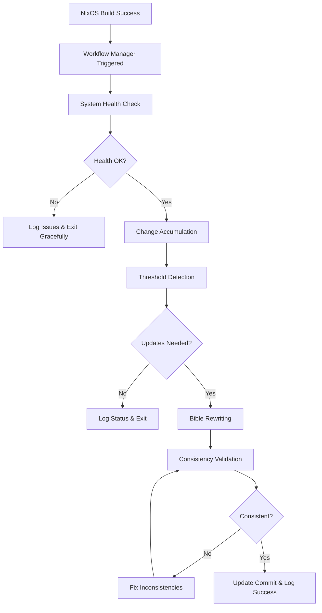
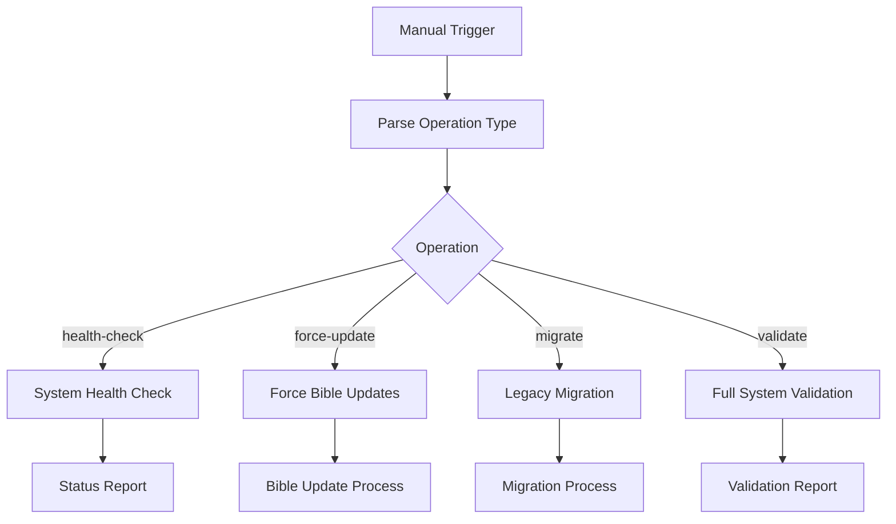
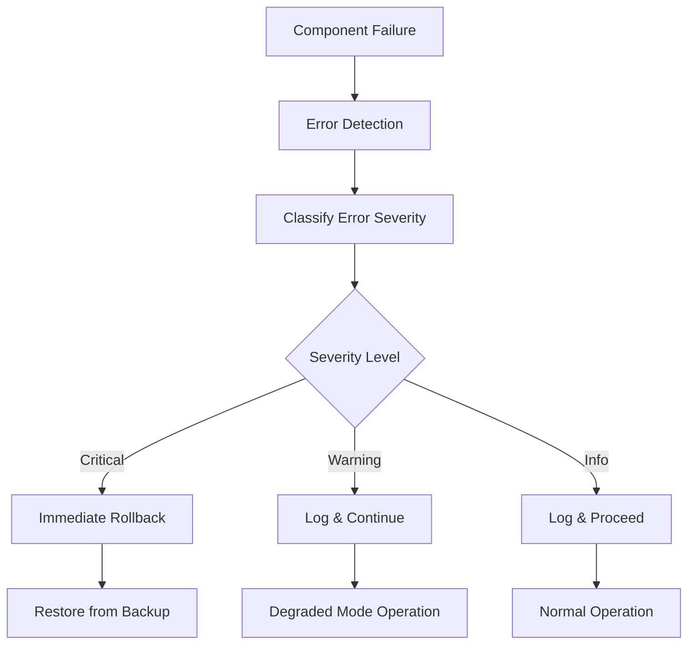

# AI Bible Documentation System - Workflow Manager Specification
**Agent 7: Integration & Workflow Manager**

## 🎯 Overview

The Bible Workflow Manager serves as the central orchestrator for the AI Bible Documentation System, coordinating all components in a unified workflow that integrates seamlessly with the existing NixOS homeserver rebuild process.

## 🏗️ System Architecture

### Core Components Orchestrated
1. **Change Accumulator** (Agent 2) - Tracks and analyzes system changes
2. **Threshold Detection** (Agent 3) - Determines when bible updates are needed  
3. **Bible Rewriter** (Agent 4) - AI-powered bible content updates
4. **Consistency Manager** (Agent 5) - Cross-bible validation and consistency
5. **Content Migrator** (Agent 6) - Legacy documentation migration
6. **Configuration System** (Agent 8) - System configuration and deployment

### Workflow Integration Points
- **Pre-build**: System validation and health checks
- **Post-successful-build**: Change analysis and bible updates  
- **Post-failed-build**: Error logging and system recovery
- **On-demand**: Manual bible updates and maintenance operations

## 📋 Workflow Orchestration Design

### Primary Workflow: Post-Successful-Build


### Secondary Workflow: Manual Operations


### Error Recovery Workflow


## 🔧 Component Integration Specifications

### 1. Change Accumulation Integration
**Responsibility**: Track changes since last bible update
**Interface**:
```python
class ChangeAccumulatorInterface:
    def get_accumulated_changes(self, since: datetime) -> Dict[str, List[Change]]
    def reset_accumulation(self, bible_categories: List[str]) -> bool
    def get_significance_scores(self) -> Dict[str, float]
```

**Integration Points**:
- Called after successful NixOS builds
- Resets accumulation after successful bible updates
- Provides change significance for threshold detection

### 2. Threshold Detection Integration
**Responsibility**: Determine which bibles need updates
**Interface**:
```python
class ThresholdManagerInterface:
    def check_thresholds(self, changes: Dict[str, List[Change]]) -> Dict[str, bool]
    def get_next_review_time(self) -> datetime
    def force_update_override(self, bible_names: List[str]) -> bool
```

**Integration Points**:
- Receives accumulated changes for analysis
- Returns list of bibles requiring updates
- Handles manual override scenarios

### 3. Bible Rewriter Integration  
**Responsibility**: Update bible content with AI assistance
**Interface**:
```python
class BibleRewriterInterface:
    def update_bible(self, bible_name: str, changes: List[Change]) -> BibleUpdateResult
    def batch_update_bibles(self, update_requests: Dict[str, List[Change]]) -> Dict[str, BibleUpdateResult]
    def validate_ai_connectivity(self) -> bool
```

**Integration Points**:
- Updates specific bibles based on threshold detection
- Handles batch updates for efficiency
- Validates AI model availability before starting

### 4. Consistency Manager Integration
**Responsibility**: Ensure cross-bible consistency
**Interface**:
```python
class ConsistencyManagerInterface:
    def validate_consistency(self, updated_bibles: List[str]) -> ConsistencyResult
    def fix_inconsistencies(self, issues: List[ConsistencyIssue]) -> bool
    def get_dependency_order(self, bible_names: List[str]) -> List[str]
```

**Integration Points**:
- Validates after bible updates complete
- Fixes cross-references and dependency issues
- Ensures proper update ordering

## 🚨 Error Handling & Recovery Specifications

### Error Classification System
```python
class ErrorSeverity(Enum):
    CRITICAL = "critical"    # System-breaking, immediate rollback
    WARNING = "warning"      # Degraded function, continue with caution  
    INFO = "info"           # Informational, normal operation

class WorkflowError(Exception):
    def __init__(self, component: str, severity: ErrorSeverity, message: str, details: Dict = None):
        self.component = component
        self.severity = severity
        self.message = message
        self.details = details or {}
```

### Recovery Mechanisms

#### 1. Component Failure Recovery
- **Change Accumulator Failure**: Continue without change tracking, log warning
- **Threshold Detection Failure**: Skip threshold checks, proceed with manual override
- **AI Model Unavailable**: Skip bible updates, schedule retry
- **Consistency Validation Failure**: Rollback bible changes, restore from backup

#### 2. Backup & Rollback Strategy
- **Pre-operation Backup**: Create backup before any bible modifications
- **Incremental Backups**: Save state after each successful component operation
- **Rollback Points**: Well-defined restoration points for different failure scenarios
- **Partial Recovery**: Ability to recover individual components without full system rollback

#### 3. Graceful Degradation
- **AI Unavailable**: Continue system operation, queue updates for later
- **Storage Issues**: Redirect logs to alternate location, reduce backup retention
- **Network Issues**: Skip remote operations, continue local processing
- **Permission Issues**: Log errors, continue with available permissions

## 📊 Logging & Monitoring Specifications

### Logging Architecture
```python
class WorkflowLogger:
    def __init__(self, component: str, correlation_id: str):
        self.component = component
        self.correlation_id = correlation_id
        
    def log_workflow_start(self, trigger: str, context: Dict)
    def log_component_start(self, component: str, operation: str)
    def log_component_success(self, component: str, duration: float, details: Dict)
    def log_component_failure(self, component: str, error: WorkflowError)
    def log_workflow_complete(self, success: bool, duration: float, summary: Dict)
```

### Monitoring Metrics
1. **Workflow Execution Metrics**
   - Total workflow duration
   - Component execution times
   - Success/failure rates
   - Error frequency by component

2. **System Health Metrics**
   - Bible update frequency
   - Change accumulation rates  
   - AI model response times
   - Consistency validation results

3. **Performance Metrics**
   - Memory usage during operations
   - Disk I/O during bible updates
   - Network requests to AI model
   - File system operations

### Log Structure
```json
{
  "timestamp": "2025-08-07T10:30:00Z",
  "correlation_id": "workflow_20250807_103000_abc123",
  "component": "workflow_manager",
  "operation": "post_build_workflow", 
  "level": "INFO",
  "message": "Starting post-build workflow",
  "context": {
    "trigger": "nixos_rebuild_success",
    "build_id": "build_12345",
    "changes_detected": 5
  },
  "duration_ms": null,
  "success": null
}
```

## 🏥 Health Check & Status Reporting

### System Health Checks
1. **Component Availability**
   - All workflow components responsive
   - AI model connectivity
   - File system access permissions
   - Git repository status

2. **Resource Health**
   - Available disk space
   - Memory usage levels  
   - CPU availability
   - Network connectivity

3. **Data Integrity**
   - Configuration file validity
   - Bible file consistency
   - Backup availability
   - Log file accessibility

### Status Reporting Interface
```python
class SystemStatus:
    def __init__(self):
        self.overall_status: str  # "healthy", "degraded", "failed"
        self.component_status: Dict[str, ComponentStatus]
        self.last_update: datetime
        self.next_scheduled_operation: Optional[datetime]
        self.active_warnings: List[str]
        self.recent_errors: List[WorkflowError]

class ComponentStatus:
    def __init__(self):
        self.name: str
        self.status: str  # "online", "offline", "degraded"
        self.last_success: datetime
        self.last_error: Optional[WorkflowError]
        self.performance_metrics: Dict[str, float]
```

## 🔧 Debugging & Troubleshooting Tools

### Debug Mode Operations
1. **Verbose Logging**: Detailed component interaction logs
2. **Step-by-Step Execution**: Manual workflow advancement  
3. **Component Isolation**: Test individual components separately
4. **Mock Mode**: Simulate component responses for testing

### Troubleshooting Commands
```bash
# Health check with detailed output
bible_workflow_manager.py --health-check --verbose

# Debug specific workflow step
bible_workflow_manager.py --debug-step change_accumulation

# Test component integration
bible_workflow_manager.py --test-component threshold_detection

# Force workflow execution with debugging
bible_workflow_manager.py --force-workflow --debug-mode

# Generate comprehensive system report
bible_workflow_manager.py --system-report --include-metrics
```

### Diagnostic Tools
1. **Component Connectivity Tester**: Verify all component interfaces
2. **Workflow Simulator**: Test workflows without making changes
3. **Performance Profiler**: Identify workflow bottlenecks
4. **Configuration Validator**: Verify system configuration integrity

## 📈 Performance & Scalability Specifications

### Performance Targets
- **Total Workflow Duration**: < 3 minutes for standard operations
- **Component Startup**: < 10 seconds per component initialization
- **Bible Update Processing**: < 2 minutes per bible
- **Consistency Validation**: < 30 seconds for full system check
- **Memory Usage**: < 1GB RAM during peak operation
- **Disk I/O**: Minimize file system operations through intelligent caching

### Scalability Considerations
1. **Concurrent Operations**: Support parallel component execution where safe
2. **Large Bible Handling**: Efficient processing of large documentation files
3. **Change Volume**: Handle high-frequency change accumulation
4. **Multi-Host Support**: Design for potential multi-server deployment

## 🔐 Security & Safety Specifications

### Security Requirements
1. **Process Isolation**: Components run with minimal required permissions
2. **Input Validation**: All external inputs validated before processing
3. **Secure Communication**: Encrypted communication with AI models
4. **Audit Logging**: All system changes logged with user attribution
5. **Access Control**: File system access restricted to required paths

### Safety Mechanisms
1. **Atomic Operations**: All bible updates are atomic (succeed completely or fail completely)
2. **Backup Verification**: Verify backup integrity before proceeding with operations
3. **Rollback Testing**: Regular testing of rollback procedures
4. **Resource Limits**: Prevent resource exhaustion through operational limits
5. **Deadlock Prevention**: Avoid component interaction deadlocks

## 🎯 Integration Requirements

### NixOS Integration
- **Non-Disruptive**: Must not interfere with normal NixOS rebuild operations
- **Hook Integration**: Integrate via existing git hooks and systemd services
- **Configuration Management**: Use standard NixOS configuration patterns
- **Service Dependencies**: Proper systemd service dependencies and ordering

### Existing Workflow Integration  
- **Trigger Points**: Integrate at appropriate points in existing workflows
- **State Preservation**: Maintain system state across workflow executions
- **User Experience**: Transparent operation from user perspective
- **Backwards Compatibility**: Maintain compatibility with existing documentation

---

## 📋 Implementation Checklist

### Core Functionality
- [ ] Workflow orchestration engine
- [ ] Component interface definitions
- [ ] Error handling and recovery system
- [ ] Comprehensive logging framework
- [ ] Health monitoring system
- [ ] Status reporting interface

### Integration & Testing
- [ ] NixOS rebuild workflow integration
- [ ] Git hook integration
- [ ] Systemd service configuration
- [ ] Component interaction testing
- [ ] Error scenario testing
- [ ] Performance benchmarking

### Operations & Maintenance
- [ ] Debug and troubleshooting tools
- [ ] System administration interfaces
- [ ] Documentation and user guides
- [ ] Monitoring dashboard integration
- [ ] Automated testing suite
- [ ] Deployment automation

---

**Document Version**: 1.0  
**Agent**: 7 - Integration & Workflow Manager  
**Priority**: High - System orchestration  
**Estimated Implementation**: 3-4 hours  
**Dependencies**: Agents 1-6 deliverables  
**Success Criteria**: Seamless NixOS integration, robust error handling, clear troubleshooting capabilities
EOF < /dev/null